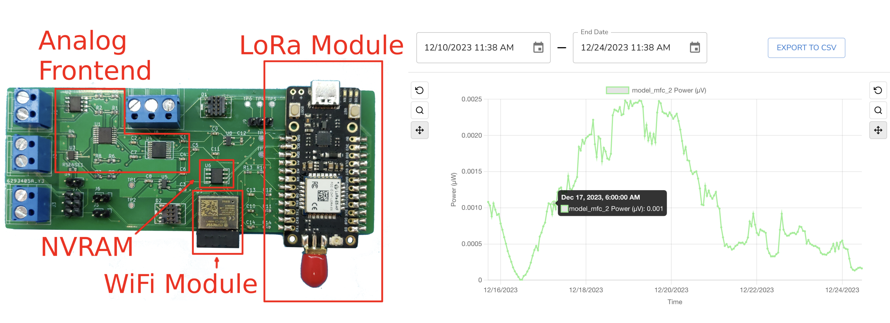

# ENTS: Environmental NeTworked Sensing

**A Living Open-Source Platform for Real-World Wireless Sensor Networks**

ENTS (Environmental NeTworked Sensing) is an open-source hardware, firmware, and software ecosystem for building environmental sensor networks that are low-cost, extensible, and field-ready. Co-designed with domain scientists, ENTS enables long-lived, scalable, and interdisciplinary sensing deployments in diverse real-world conditions—from soil microbial fuel cells and desert cacti to vineyard ecosystems and marshland monitoring.

ENTS supports researchers and practitioners across environmental sciences, agroecology, and embedded systems by offering:

- Precision analog measurement for ultra-low power sources
- Plug-and-play support for environmental sensors via SDI-12 and I2C
- End-to-end infrastructure: from data collection to cloud visualization
- Iteratively tested, community-informed design for real-world conditions

---

## Quick Links

| Component        | Repository | Description |
|------------------|------------|-------------|
| 🛠️ **Hardware** | [ENTS-node-hardware](https://github.com/jlab-sensing/ENTS-node-hardware) | PCB schematics, enclosure designs, BOMs for ENTS sensor nodes |
| ⚙️ **Firmware**  | [ENTS-node-firmware](https://github.com/jlab-sensing/ENTS-node-firmware) | C firmware for STM32/ESP32-based ENTS nodes |
| 🌐 **Backend**   | [ENTS-backend](https://github.com/jlab-sensing/ENTS-backend) | Flask API, data visualization, and live monitoring tools |

> **📖 Relevant papers**:  
> - [Hardware to enable large-scale deployment and observation of soil microbial fuel cells, ENSsys 2022 (PDF)](https://dl.acm.org/doi/pdf/10.1145/3560905.3568110)
> - [Hardware to unleash novel energy sources for outdoor sensor networks, SenSys 2025 Demo Abstract (PDF)](https://sensors.soe.ucsc.edu/assets/pdf/2025_SenSys_ENTS_Demo_Abstract.pdf)
> &nbsp;

💬 Questions? Join the conversation on [ENTS Zulip Chat](https://ents.zulipchat.com)!

---

## 🔍 System Overview

<figure>
  
  <figcaption><em>Figure 1:</em> Our low-cost, open-source hardware (left) measures collects data from arbitrary sensors (e.g. temperature, power monitoring), and transmits measurements wirelessly. A visualization backend (right) receives data from the hardware nodes and presents it in an easy-to-use web interface that allows users to dynamically generate plots, or download data for offline processing.
</figcaption>
</figure>

---

## Why ENTS?

Many wireless sensor network (WSN) platforms remain inaccessible, under-documented, or quickly deprecated. ENTS breaks that mold.

It is:
- **Accessible**: Designed to work out-of-the-box with intuitive setup, visualization, and configuration tools.
- **Extensible**: Easily integrate new sensors or expand capabilities with SDI-12/I2C interfaces and modular backend.
- **Field-Ready**: Deployed across farms, marshes, and wildlands—with robust enclosures and wireless (LoRa/WiFi) options.
- **Community-Grown**: Developed through real-world co-design with domain scientists and continuously evolving.

---

## Key Features

- **Multi-channel sensing**: Differential analog, SDI-12, and I2C support
- **Wireless**: LoRaWAN (field) and WiFi (lab) communication
- **Power-efficient**: Optimized for long deployments on Li-ion or energy-harvested power
- **Open-hardware**: Custom PCBs and 3D-printable enclosures
- **Data pipeline**: Real-time streaming, local buffering, and browser-accessible visualization

---

## Example Use Cases

🧪 **Soil Microbial Fuel Cells**  
📈 **Leaf Wetness and Soil Moisture Monitoring**  
🌵 **Energy Harvesting from Cacti**  
🌍 **Digital Twins for Agroecological Research**

---

## Getting Started

1. **Hardware**:  
   Visit the [ENTS-node-hardware repo](https://github.com/jlab-sensing/ENTS-node-hardware) for design files, parts list, and fabrication instructions.

2. **Firmware**:  
   See [ENTS-node-firmware](https://github.com/jlab-sensing/ENTS-node-firmware) for STM32/ESP32 firmware setup and sensor drivers.

3. **Visualization and Backend**:  
   Explore [ENTS-backend](https://github.com/jlab-sensing/ENTS-backend) for a self-hostable backend (Flask API + frontend), or view a demo deployment (coming soon).

---

## Community and Contributions

ENTS is actively maintained and welcomes contributions! Whether you are adding support for new sensors, submitting bug fixes, or deploying ENTS in your own research—we'd love to hear from you.

- 🌱 Become a contributor and help us grow the project! Visit any of the repositories to see open issues, or suggest your own
- 💬 Join the conversation on [ENTS Zulip Chat](https://ents.zulipchat.com)
- 📦 Need an ENTS board, or interested in becoming a domain partner? Contact us via zulip or <a href="mailto:ents-group&#64;ucsc&#46;edu">ents-group&#64;ucsc&#46;edu</a>

---

## About

ENTS was originally developed and maintained by the [jLab in Smart Sensing](https://sensors.soe.ucsc.edu/) at UC Santa Cruz. It is the result of a multi-year co-design effort with agroecologists, biologists, and engineers to create an enduring, useful platform for environmental monitoring.

---

*This project is supported in part by UC Santa Cruz Agricultural Experiment Station funding provided by the state of California, Hatch Act of 1887 funding from the U.S. Department of Agriculture, National Institute of Food and Agriculture, and by the intramural research program of the U.S. Department of Agriculture, National Institute of Food and Agriculture, Hatch Funds (Accession number, 7010079). The Findings and Conclusions in This Preliminary Publication Have Not Been Formally Disseminated by the U. S. Department of Agriculture and Should Not Be Construed to Represent Any Agency Determination or Policy.*